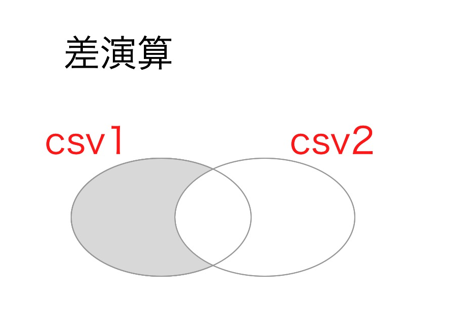
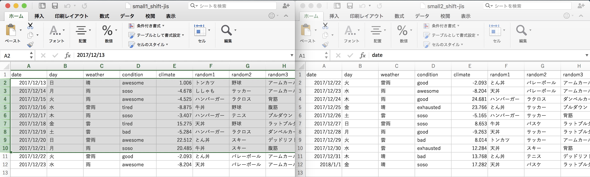
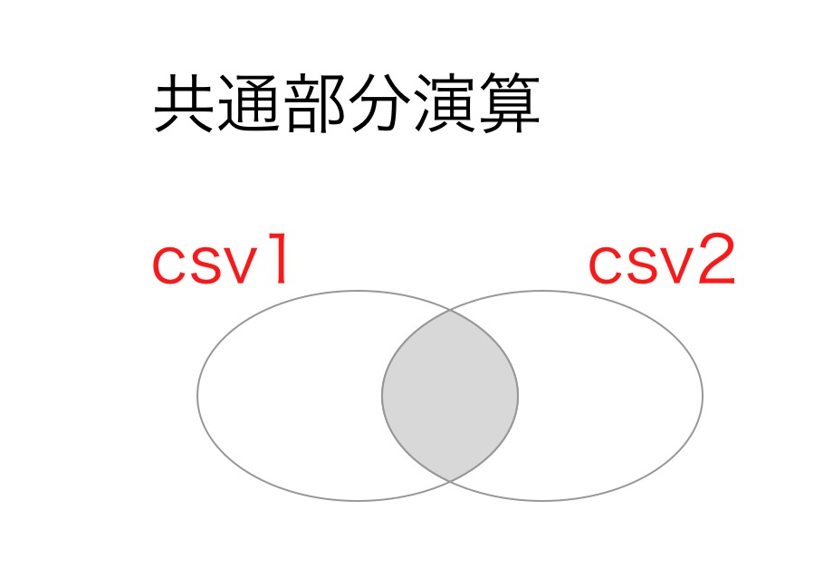
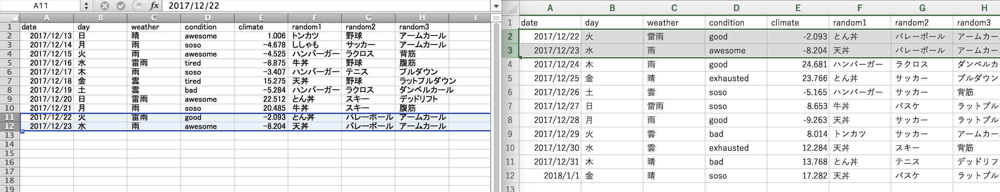
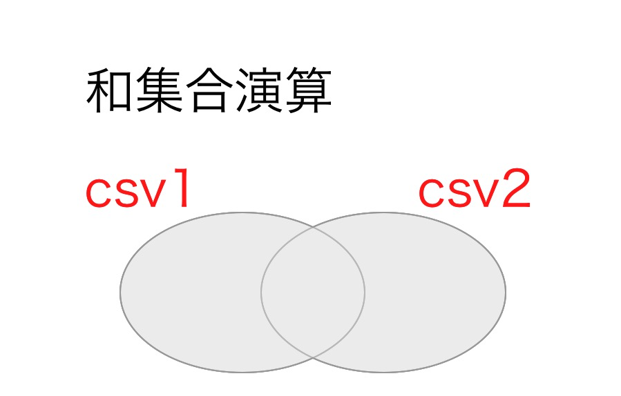
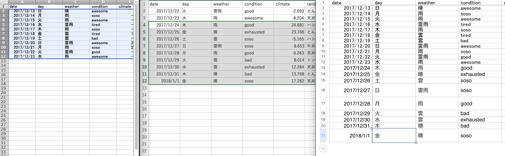

# Pythonの基礎演習

## Objective

Pythonの基本構文の理解を深めてもらう.

具体的には以下の基本的なトピックについての理解を深めてもらう.

- 標準入力: print
- 関数定義: def
- ループ: for/whileループ
- 条件分岐: if
- リスト構造: \[\]
- 基本的な文字列操作(正規表現を含まない)
- Pythonモジュールの使い方(import文)

## 課題1

csv_1とcsv_2について
次のような差演算, 共通演算, 和演算の関数を定義せよ

### 差演算

2つのcsv(csv1,csv2)を受け取って,
csv1の一部でcsv2と重複しない行からなる配列を作る.

ベン図で言うとこんな感じです.

#### さらに具体例:

csv1としてsmall1_shift-jis.csv,
csv2としてsmall2_shift-jis.csvを用意しました.
下の画像の左がcsv1,右がcsv2です.

下の画像の左のハイライトされた行を返すような演算です.
(csv2に含まれないようなcsv1の行を返すってこと)

### 共通部分演算
2つのcsv(csv1,csv2)を受け取って,
csv1の一部でcsv2と重複する行のみからなる配列を作る.

ベン図で言うとこんな感じです.

#### さらに具体例:

csv1としてsmall1_shift-jis.csv,
csv2としてsmall2_shift-jis.csvを用意しました.
下の画像の左がcsv1,右がcsv2です.

下の画像の両方のハイライトされた行を返すような演算です.
(csv1に含まれかつcsv1にも含まれる行を返すってこと)

### 和演算

2つのcsv(csv1,csv2)を受け取って,
csv1とcsv2の全ての行を重複せず含む配列をを作る.

ベン図で言うとこんな感じです.

#### さらに具体例:

csv1としてsmall1_shift-jis.csv,
csv2としてsmall2_shift-jis.csvを用意しました.
下の画像の左がcsv1,真ん中がcsv2です.

2つのcsvから重複を許さずに1つの表を作るってことです.

画像でいうと,左2つの表から一番右の表を作るってイメージです.

以上の3つの演算をqestion1.pyにて実装してね！
pythonの設定とかデータの読み込みとか関数名とかはquestion1.pyを使ってちょ.
