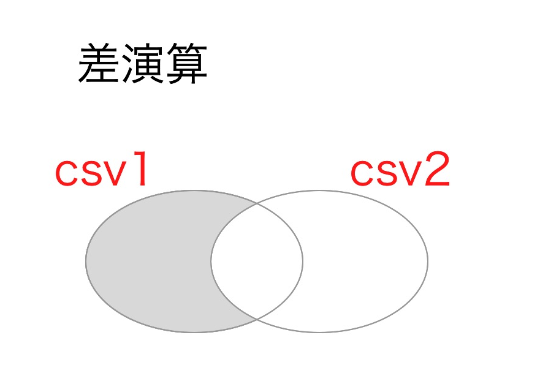
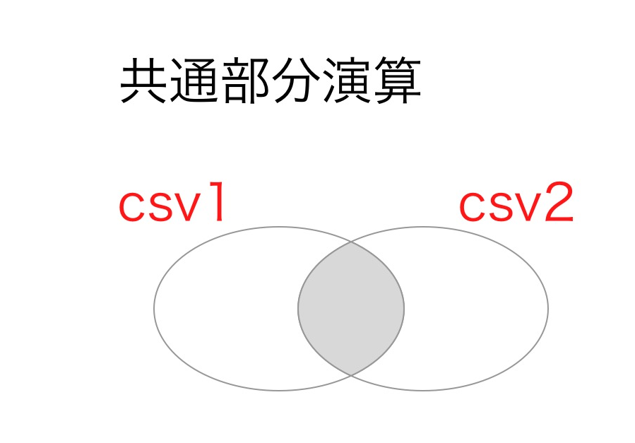
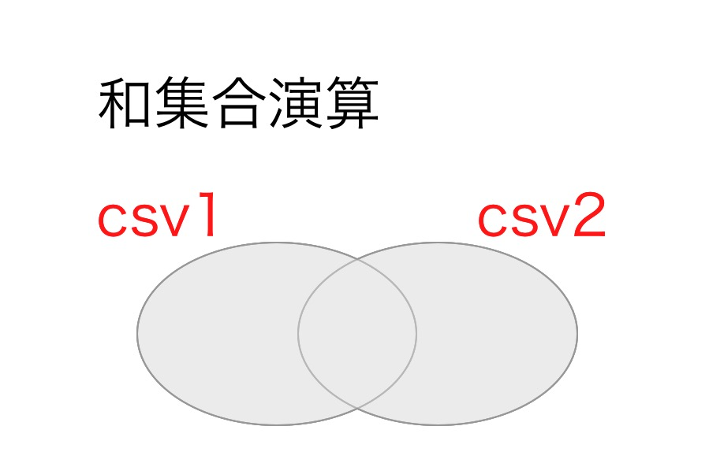
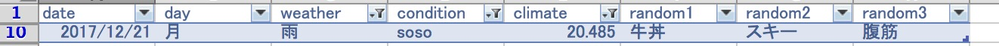
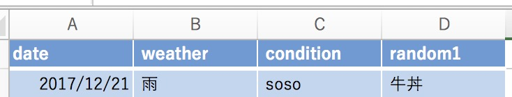

# Pythonの基礎演習

## Objective

Pythonの基本構文の理解を深めてもらう。

具体的には以下の基本的なトピックについての理解を深めてもらう。

- 標準入力: print
- 関数定義: def
- ループ: for/whileループ
- 条件分岐: if
- リスト構造: \[\]
- 基本的な文字列操作(正規表現を含まない)
- Pythonモジュールの使い方(import文)

## 課題内容(略式 for myself)

### 課題1

読み込んだ2つのcsvデータに対しての

- 差演算
- 共通演算
- 集合演算

の実装(関数定義)とその関数を実際に使用してみる。

具体的には、
ヘッダー:"date", "day", "weather", "condition", "climate", "random1", "random2", "random3"
の2つのテーブル(database)に対しての演算。

### 課題2

読み込んだ1つのcsvデータに対しての

- 選択演算
- 射影演算

の実装(関数定義)とその関数を実際に使用してみる。

具体的には、
ヘッダー:"date", "day", "weather", "condition", "climate", "random1", "random2", "random3"
の2つのテーブル(database)に対しての

1. condition = "XXX", climate > X, random1 = "XX"の選択演算
2. (1で選択した)dbの"date", "condition" "climate", "random1", "random3"なるdbへの射影演算。

## 課題内容(丁寧なバージョン)

### 課題1:

csv_1とcsv_2について
次のような差演算, 共通演算, 和演算の関数を定義せよ

#### 差演算

2つのcsv(csv1,csv2)を受け取って、
csv1の一部でcsv2と重複しない行からなる配列を作る。

ベン図で言うとこんな感じです。

##### さらに具体例:

csv1としてsmall1_shift-jis.csv,
csv2としてsmall2_shift-jis.csvを用意しました。
下の画像の左がcsv1,右がcsv2です。

下の画像の左のハイライトされた行を返すような演算です。
(csv2に含まれないようなcsv1の行を返すってこと)

#### 共通部分演算
2つのcsv(csv1,csv2)を受け取って、
csv1の一部でcsv2と重複する行のみからなる配列を作る。

ベン図で言うとこんな感じです。

##### さらに具体例:

csv1としてsmall1_shift-jis.csv,
csv2としてsmall2_shift-jis.csvを用意しました。
下の画像の左がcsv1,右がcsv2です。

下の画像の両方のハイライトされた行を返すような演算です。
(csv1に含まれかつcsv1にも含まれる行を返すってこと)

#### 和演算

2つのcsv(csv1,csv2)を受け取って、
csv1とcsv2の全ての行を重複せず含む配列をを作る。

ベン図で言うとこんな感じです。

##### さらに具体例:

csv1としてsmall1_shift-jis.csv,
csv2としてsmall2_shift-jis.csvを用意しました。
下の画像の左がcsv1,真ん中がcsv2です。

2つのcsvから重複を許さずに1つの表を作るってことです。

画像でいうと、左2つの表から一番右の表を作るってイメージです。

以上の3つの演算をqestion1.pyにて実装してね！
pythonの設定とかデータの読み込みとか関数名とかはquestion1.pyを使ってちょ。

### 課題2:

ヘッダ(列タイトル)が"date", "day", "weather", "condition", "climate", "random1", "random2", "random3"
であるcsvがあるとする。

- weatherの列は"晴", "雲", "雨", "雷雨"のいずれかである。
- conditionの列は"good", "bad", "soso", "awesome", "tired", "exhausted"のいずれかである。
- climateの列は-10以上30以下の実数全体である。
- random1の列は"ハンバーガー", "牛丼", "天丼", "とん丼", "トンカツ", "ししゃも"のいずれかである。

#### 選択演算

選択演算とは、与えられたテーブルに対して、何らかの条件で要素を絞り込む操作のことである。

#### 射影演算

射影演算とは、与えられたテーブルに対して、そのテーブルの一部の列からなるテーブルを作成する操作のことである。

csv_1について次のような選択演算、射影演算の関数を定義せよ。

あるcsv(ヘッダが上と同様の何らかのcsvファイル)に対して
weatherがX(weatherの任意の要素)でかつ、
conditionがY(conditionの任意の要素)でかつ、
climateがZ(-10以上30以下の任意の実数)以上であるような行のみを抽出する選択演算を行う
関数select(csv, X,Y,Z)を作れ。

あるcsv(ヘッダが上と同様の何らかのcsvファイル)に対して、
任意のヘッダの部分集合配列からなる射影演算を行う関数project(csv, headerSet)を作れ。

以上を作った上で、
csv_1(large1_shift-jis.csv)に対して、

- weatherが雨
- conditionがsoso
- climateが0以上

の行からなるcsv要素を抽出せよ。

ちなみにsmall1_shift-jis.csvを使ってexcelのテーブル操作でやってみるとこういうことになります。

なので、まず、関数を作って見たときは、small1_shift-jis.csvでテストしてみると良いかと思われます。

また、抽出したcsv要素に対して、
date, weather, condition, random1の列からなるcsv要素でできた配列を作成した射影関数で射影せよ。

選択演算と同様にexcelで示すと、

となります。