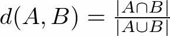

# advancedの説明

## 前提知識

Jaccard Similarity Coefficient (JSC(非公式呼称))

2つの集合の類似度を計算する方法の1つ。
あるいは距離函数の一種とも言えるし、2つの集合の類似確率とも言える。

任意の集合A,Bに対してのJSCをd(A,B)と表現する。

$d(A,B) = \frac{|A\cap B|}{|A\cup B|}$

## やること

まず、generate-testing-images.pyとgenerate-training-images.pyをrunする。
そうすると、testフォルダとtrainフォルダができます。
この二つのフォルダの中には、10個のフォルダ(0,1,2,3,4,...,9)があります。
それぞれのフォルダの中には、手書き数字のデジタル画像を処理したcsvファイルがたくさんあります。

その他こまけえことは、もしもadvancedに手を出す余裕がありそうだったらば、わいの所にきてくれれば説明します。

testフォルダ以下に存在する任意の1つのcsv(test)に対して、
trainフォルダ以下の各フォルダ(0~9)内の全てのcsv(train)とのJaccard Similarity Coefficient(JSC)を計算する。
計算したJSCが最大となるようなcsv(train)が含まれるフォルダ名をprintする。

## やってること(roughly speaking)

手書き文字をJSCを基準に識別するナイーブな機械学習。

## 具体的手続き

1. testフォルダの任意のcsv(test)をadvancedフォルダ下にコピー or 移動
2. csv(test)と全てのcsv(train)とのJSCを計算する
    1. csv(test)とcsv(train)の共通部分集合の要素数÷和集合の要素数を計算する
3. 2で計算した全てのJSCのうち最大の値を示すcsv(train)のcsvファイルが含まれるフォルダをprintせよ

それが今回のjscを用いた手書き文字のデジタル画像認識の機械学習の結果だぴょん。

