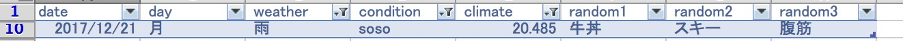
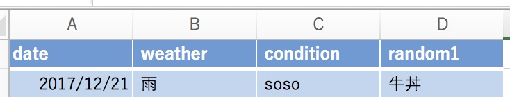

# Pythonの基礎演習

## 課題2:

ヘッダ(列タイトル)が"date", "day", "weather", "condition", "climate", "random1", "random2", "random3"
であるcsvがあるとする.

- weatherの列は"晴", "雲", "雨", "雷雨"のいずれかである.
- conditionの列は"good", "bad", "soso", "awesome", "tired", "exhausted"のいずれかである.
- climateの列は-10以上30以下の実数全体である.
- random1の列は"ハンバーガー", "牛丼", "天丼", "とん丼", "トンカツ", "ししゃも"のいずれかである.

### 選択演算

選択演算とは,与えられたテーブルに対して,何らかの条件で要素を絞り込む操作のことである.

### 射影演算

射影演算とは,与えられたテーブルに対して,そのテーブルの一部の列からなるテーブルを作成する操作のことである.

csv_1について次のような選択演算,射影演算の関数を定義せよ.

あるcsv(ヘッダが上と同様の何らかのcsvファイル)に対して
weatherがX(weatherの任意の要素)でかつ,
conditionがY(conditionの任意の要素)でかつ,
climateがZ(-10以上30以下の任意の実数)以上であるような行のみを抽出する選択演算を行う
関数select(csv, X,Y,Z)を作れ.

あるcsv(ヘッダが上と同様の何らかのcsvファイル)に対して,
任意のヘッダの部分集合配列からなる射影演算を行う関数project(csv, headerSet)を作れ.

以上を作った上で,
csv_1(large1_shift-jis.csv)に対して,

- weatherが雨
- conditionがsoso
- climateが0以上

の行からなるcsv要素を抽出せよ.

ちなみにsmall1_shift-jis.csvを使ってexcelのテーブル操作でやってみるとこういうことになります.

なので,まず,関数を作って見たときは,small1_shift-jis.csvでテストしてみると良いかと思われます.

また,抽出したcsv要素に対して,
date, weather, condition, random1の列からなるcsv要素でできた配列を作成した射影関数で射影せよ.

選択演算と同様にexcelで示すと,

となります.